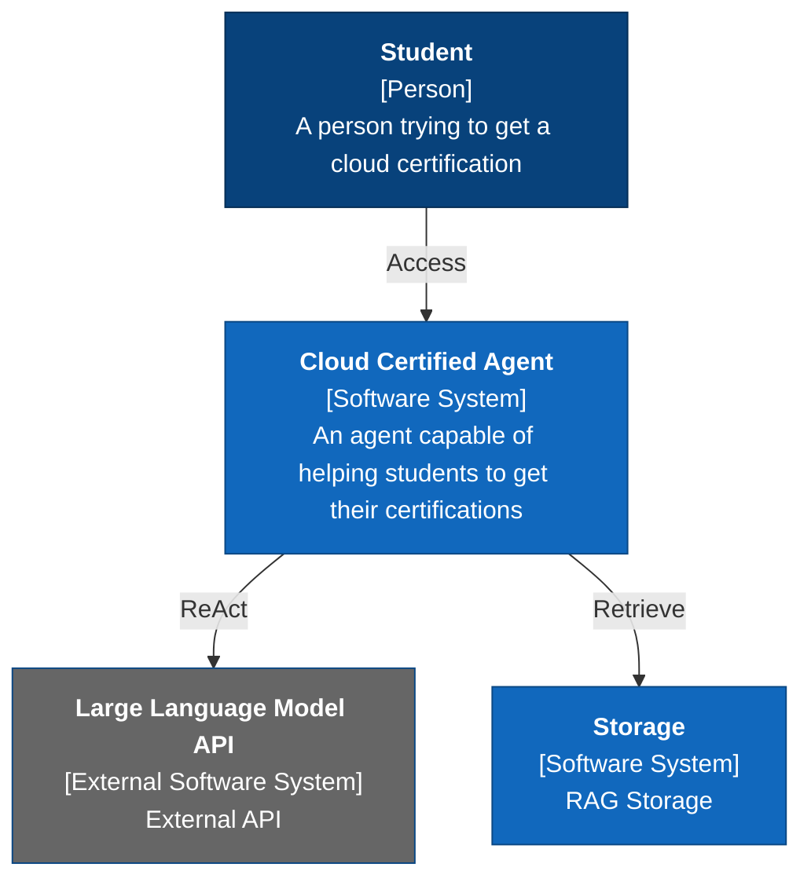
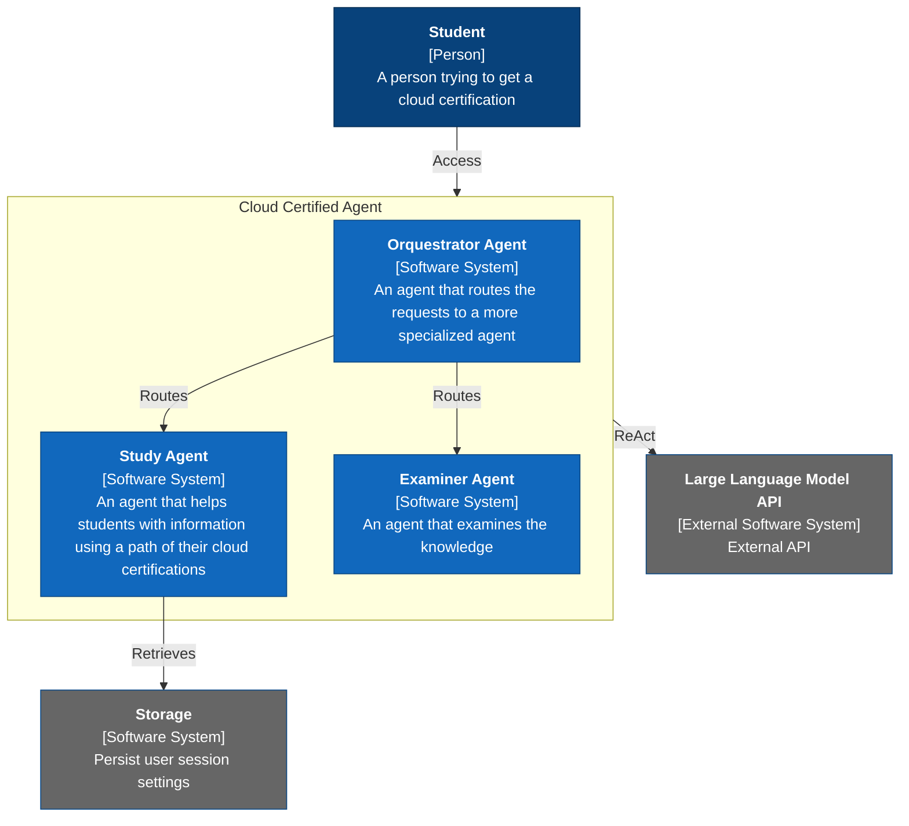

# Cloud Certification Study Agent

A Cloud certification study agent that helps you to build knowledge for a given cloud certification.

## System Context Diagram

```mermaid
flowchart TD
    User["`**Student**
    [Person]
    A person trying to get a cloud certification`"]

    CCA["`**Cloud Certified Agent**
    [Software System]
    An agent capable of helping students to get their certifications`"]

    LLM["`**Large Language Model API**
    [External Software System]
    External API`"]

    DB["`**Storage**
    [Software System]
    RAG Storage`"]

    User -- "Access" --> CCA

    CCA -- "ReAct" --> LLM
    CCA -- "Retrieve" --> DB


    classDef focusSystem fill:#1168bd,stroke:#0b4884,color:#ffffff
    classDef supportingSystem fill:#666,stroke:#0b4884,color:#ffffff
    classDef person fill:#08427b,stroke:#052e56,color:#ffffff

    class User person
    class CCA,DB,R focusSystem
    class LLM supportingSystem
```

## Container Diagram

```mermaid
flowchart TD
    User["`**Student**
    [Person]
    A person trying to get a cloud certification`"]

    subgraph CCA[Cloud Certified Agent]
        direction TB

        Orq["`**Orquestrator Agent**
        [Software System]
        An agent that routes the requests to a more specialized agent`"]


        Study["`**Study Agent**
        [Software System]
        An agent that helps students with information using a path of their cloud certifications`"]


        Examiner["`**Examiner Agent**
        [Software System]
        An agent that examines the knowledge`"]


        Orq -- "Routes" --> Study
        Orq -- "Routes" --> Examiner
    end

    LLM["`**Large Language Model API**
    [External Software System]
    External API`"]

    DB["`**Storage**
    [Software System]
    Persist user session settings`"]

    User -- "Access" --> CCA
    Study -- "Retrieves" --> DB
    CCA -- "ReAct" --> LLM

    classDef person fill:#08427b,stroke:#052e56,color:#ffffff
    classDef container fill:#1168bd,stroke:#0b4884,color:#ffffff
    classDef supportingSystem fill:#666,stroke:#0b4884,color:#ffffff

    class User person
    class Orq,Study,Examiner container
    class DB,LLM supportingSystem
```